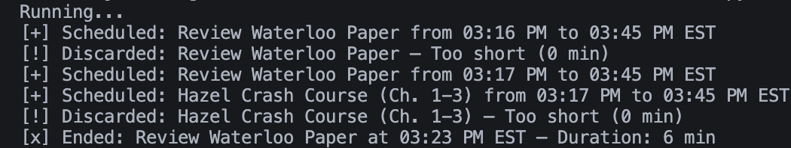

# Notion + Google Calendar Sync Bot

A Python bot that monitors a Notion database for tasks and syncs "In Progress" tasks to your Google Calendar.



## Features

- Automatically schedules "In Progress" Notion tasks as Google Calendar events
- Ends or discards events when tasks are paused or completed
- Checks Notion every 10 seconds

## Setup

1. **Notion:**  
   - Create a Notion integration and share your database with it.
   - Note your Notion integration token and database ID.

2. **Google:**  
   - Create a Google Cloud Project.
   - Enable the Google Calendar API.
   - Download `credentials.json` (OAuth Client ID for Desktop App).

3. **Environment:**  
   - Create a `.env` file with:
     ```
     NOTION_TOKEN=your_notion_token
     DATABASE_ID=your_database_id
     ```

4. **Install dependencies:**  
   ```bash
   pip install -r requirements.txt
   ```

## Usage

```bash
python main.py
```

The script will run continuously, syncing tasks between Notion and Google Calendar.

## Notes

- Sensitive files (`.env`, `credentials.json`, `token.json`, `token.pickle`) are gitignored.
- Make sure your Notion database has a "Task name", "Status", and "Calendar Event ID" property.

## License
[MIT](LICENSE)
